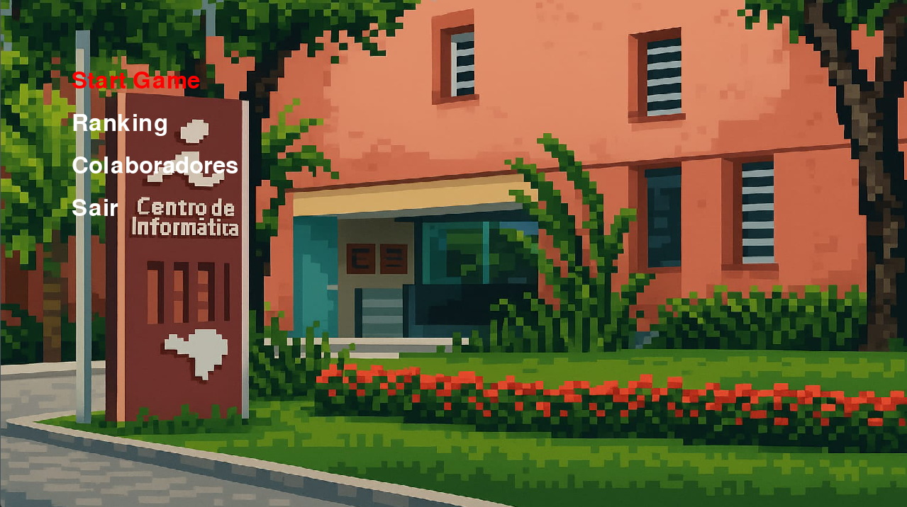
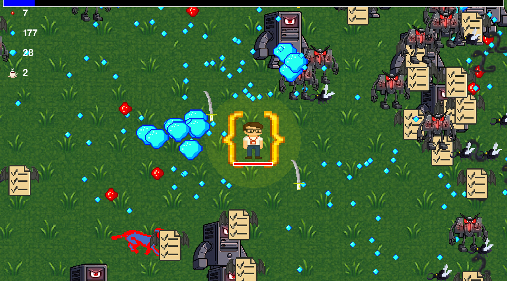

## IPocalipse CIn-vivors

> Um jogo de ação e sobrevivência no estilo *bullet heaven*, onde um estudante de Introdução à Programação deve lutar contra hordas de bugs, erros e outros desafios do periodo para sobreviver até o/a final.

**Disciplina:** Introdução à Programação - CIn/UFPE  
**Período:** 2025.1


---

## Equipe

| Nome Completo     | GitHub                               |
| :---------------- | :----------------------------------- | 
| `Rafael Barbosa`  | [@rafaelvlt](https://github.com/rafaelvlt) |
| `Eric Santiago`  | [@ARISE21](https://github.com/ARISE21)   |
| `Caio Amarante`  | [@IrineuACgasoso](https://github.com/IrineuACgasoso) |
| `Pedro Albuquerque`  | [@PHMA-PEDRO](https://github.com/PHMA-PEDRO) |
| `Kraus Junior`  | [@thatkraus](https://github.com/thatkraus) | 
| `Álvaro Lima`  | [@Alvarolima22](https://github.com/Alvarolima22) |

---

## 🏛️ Arquitetura do Projeto

O código foi organizado de forma modular e seguindo os princípios de Orientação a Objetos para garantir a clareza, a manutenibilidade e a colaboração eficiente da equipe. A estrutura principal de arquivos é a seguinte:
```
📁 ip-projeto-final/
├── 📁 assets/  # Contém todas as mídias (imagens, sons, mapas)
│
├── 📁 source/  # Contém todo o código-fonte do jogo em Python
│   ├── 🐍 main.py  # Apenas inicializa e roda o jogo.
│   ├── 🐍 game.py  # Classe 'Game', gerencia os estados do jogo
│   ├── 🐍 settings.py  # Constantes e imports utilizados por todos arquivos
│   ├── 🐍 player.py  # Define a classe 'Player' e seus comportamentos.
│   ├── 🐍 enemies.py  # Define a classes e subclasses de inimigos
│   ├── 🐍 weapon.py  # Define a classe de todas as Armas e projéteis
│   ├── 🐍 items.py  # Define os itens coletáveis (XP, vida, buffs)
│   ├── 🐍 mapa.py  # Classe que gerencia o carregamento e desenho do mapa.
│   ├── 🐍 grupos.py  # Classe customizada 'AllSprites' para a câmera.
│   ├── 🐍 hud.py  # Classe 'HUD' para desenhar a interface do jogador
│   ├── 🐍 menu.py  # Classes para as telas de menu
│   ├── 🐍 levelup.py  # Classe para a tela de upgrade de armas
│   ├── 🐍 ranking.py  # Classe para a tela de Ranking.
│   └── 🐍 colaboradores.py  # Classe para a tela de créditos/colaboradores.
│
├── 📄 .gitignore  # Define arquivos e pastas a serem ignorados pelo Git.
├── 📄 README.md  # Esta documentação.
└── 📄 requirements.txt # Lista de bibliotecas Python necessárias para rodar o projeto.
```

---

## Galeria

>Menu principal do jogo

>Personagem dentro do jogo, podemos observar 4 armas temáticas
---
## 🤝 Divisão de Trabalho

| Membro              | Responsabilidades Principais                                   |
| :------------------ | :------------------------------------------------------------- |
| `Rafael Barbosa`    | `Armas, Câmera e gerenciamento do projeto`            |
| `Álvaro Lima`       | `Menus, sistemas e máquina de estado do jogo`             |
| `Caio Amarante`    | `Jogador e coletáveis, além da criação de sprites`              |
| `Eric Santiago`    | `Mapa e Sprites, adicionou sons`           |
| `Pedro Albuquerque `    | `Criação da lógica de inimigos, spawn e hordas`   |
| `Kraus Jatobá`    | `Criações de Menu's como colaboradores e ranking, e detalhamento`   |

---
## 🛠️ Ferramentas, Bibliotecas e Frameworks

* **Linguagem:** `Python 3`
    * **Justificativa:** Linguagem principal da disciplina.
* **Biblioteca:** `Pygame`
    * **Justificativa:** Framework consolidado para desenvolvimento de jogos 2D em Python. Foi utilizado para gerenciar a janela, renderizar gráficos, capturar inputs do usuário, controlar o som e gerenciar o loop principal do jogo.
* **Editor de Código:** `Visual Studio Code`
    * **Justificativa:** Um editor de código leve, poderoso e altamente extensível. Foi a nossa principal ferramenta para escrever e depurar o código Python. Suas extensões, como o `Python` e a integração com o `Github`, foram essenciais para agilizar o desenvolvimento e facilitar a integração com o sistema de versionamento.
* **Biblioteca:** `Pytmx`
    * **Justificativa:** Biblioteca essencial para carregar e manipular mapas criados no formato `.tmx`. Ela permitiu a integração fácil dos mapas criados no Tiled Editor com o nosso motor de jogo em Pygame.
* **Editor de Mapa:** `Tiled Map Editor`
    * **Justificativa:** Ferramenta padrão de mercado para a criação de mapas de tiles 2D. Foi usada para desenhar visualmente os níveis do jogo e definir as áreas de colisão, separando o design de níveis da programação.
* **Editor de Pixel Art:** `Piskel`
    * **Justificativa:** Um editor de sprites gratuito, online e de fácil utilização, focado em pixel art. Foi fundamental para criar e editar assets visuais, como personagens, inimigos e itens.
* **Plataforma de Assets:** `Itch.io`
    * **Justificativa:** É a maior plataforma para desenvolvedores de jogos independentes e uma fonte indispensável de assets. Foi utilizada para encontrar e baixar diversos recursos visuais e de áudio (spritesheets, tilesets, efeitos sonoros) que serviram como base para a criação do nosso jogo.
* **Versionamento:** `Git & GitHub`
    * **Justificativa:** Ferramentas essenciais para o trabalho colaborativo. O Git permitiu o controle de versões do código, e o GitHub serviu como repositório central, facilitando a colaboração, a revisão de código (Pull Requests) e a organização do projeto.

---
## 📚 Conceitos da Disciplina Aplicados

* **Orientação a Objetos (OOP):** O projeto foi inteiramente construído sobre os pilares de OOP.
    * **Encapsulamento:** Cada classe (ex: `Player`, `Arma`, `Inimigo`) é responsável por gerenciar seus próprios dados e comportamentos. A classe `Game`, por exemplo, não modifica diretamente a vida do jogador; ela chama um método `player.sofrer_dano()`.
    * **Herança:** Utilizamos uma classe `Arma` abstrata da qual todas as armas específicas (`Arma_Loop`, `ArmaLista`, etc.) herdam. O mesmo foi feito para `Projetil` e `Inimigo`, permitindo reutilizar código e definir uma estrutura comum.
    * **Abstração:** A classe `Arma` é um exemplo de abstração, definindo um "contrato" com métodos abstratos como `disparar()` que cada arma concreta deve implementar.

* **Estruturas de Dados:**
    * **Listas:** Usadas extensivamente para gerenciar coleções de objetos, como as opções de upgrade na `TelaDeUpgrade` e os frames de uma animação.
    * **Dicionários:** Essenciais para sistemas como o inventário de armas do jogador (`jogador.armas`), o catálogo `TODAS_AS_ARMAS` e a contagem de coletáveis, permitindo acesso rápido aos dados por meio de chaves.
    * **Tuplas:** Utilizadas para representar dados imutáveis, como cores RGB e os grupos de sprites passados para os construtores de armas.


* **Estruturas de Controle e Lógica de Jogo:**
    * **Estruturas Condicionais:** A lógica principal do jogo, que alterna entre menus, gameplay e telas de upgrade, é controlada por uma série de blocos `if/elif/else` na classe `Game`, baseada na variável `self.estado_do_jogo`.
    * **Laços de Repetição:** Laços `for` são a base de quase todas as operações do jogo, desde percorrer grupos de sprites para atualizá-los e desenhá-los, até processar colisões e gerar opções de upgrade.
    * **Aplicação Temática dos Conteúdos:** Um dos pilares do design do nosso jogo foi criar armas que não apenas *usam*, mas também *representam* os conceitos aprendidos nas listas de exercício. Por exemplo, a arma "Companheiro Byte" usa uma lógica `if/elif/else` para decidir seu ataque, a "Bola Calderânica" representa o laço `for` através de seus projéteis, e a "Ciclo de Lâminas" simula uma `lista` de armas orbitando o jogador.
---

## Desafios e Lições Aprendidas

Esta seção detalha os obstáculos que enfrentamos e o conhecimento que adquirimos durante o desenvolvimento do projeto.

#### Qual foi o maior erro cometido durante o projeto? Como vocês lidaram com ele?

Nosso maior erro foi **subestimar a importância de uma arquitetura bem definida no início**, o que nos levou a demorar para fazer a divisão de tarefas de forma eficaz. No começo, várias lógicas (jogador, inimigos, colisões) estavam sendo adicionadas diretamente ao arquivo `game.py`, tornando-o um "monstro" difícil de gerenciar e impedindo o trabalho em paralelo.

**Como resolvemos:** Paramos o desenvolvimento de novas funcionalidades por um período e focamos em refatorar o código. Quebramos a lógica monolítica em classes com responsabilidades únicas (`Player`, `Arma`, `Inimigo`, `HUD`, etc.), cada uma em seu próprio arquivo. Após essa reestruturação, a divisão de tarefas se tornou clara e natural, e a equipe conseguiu avançar de forma muito mais rápida e organizada.

#### Qual foi o maior desafio enfrentado durante o projeto? Como vocês lidaram com ele?

O maior desafio foi **aplicar os conceitos de Programação Orientada a Objetos (OOP) na prática** e, ao mesmo tempo, gerenciar a colaboração em equipe usando **Git e GitHub**. Fazer com que diferentes sistemas, como a Câmera, a HUD, o Spawner de Inimigos e as Armas, conversassem entre si de forma limpa e desacoplada foi um grande obstáculo. Além disso, a **criação e implementação dos assets** (spritesheets, mapas) também foi um desafio, exigindo o aprendizado de novas ferramentas como o Tiled e técnicas de animação em Pygame.

**Como resolvemos:** A solução foi a **comunicação constante e o aprendizado colaborativo**. Pesquisamos ativamente por padrões de design de jogos, como a Máquina de Estados para o fluxo do jogo e o padrão Fábrica para a criação de upgrades. A equipe se ajudou mutuamente, compartilhando tutoriais, revisando o código uns dos outros (Code Review) e discutindo as melhores abordagens de arquitetura antes de implementá-las.

#### Quais as lições aprendidas durante o projeto?

* **Planejamento Primeiro, Código Depois:** Um bom planejamento e uma arquitetura sólida economizam muito mais tempo a longo prazo do que começar a codificar imediatamente.
* **A Importância do Encapsulamento:** Mover a lógica para dentro da classe a que ela pertence (ex: `player.curar()` em vez de manipular a vida do jogador no `game.py`) torna o código imensamente mais limpo e fácil de depurar.
* **Git é uma Ferramenta de Comunicação:** Usar branches para cada funcionalidade, fazer Pull Requests detalhados e ter mensagens de commit claras não é apenas uma formalidade, é essencial para que a equipe entenda a evolução do projeto.
---

